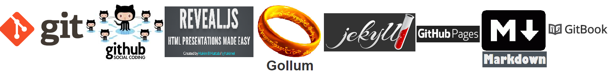
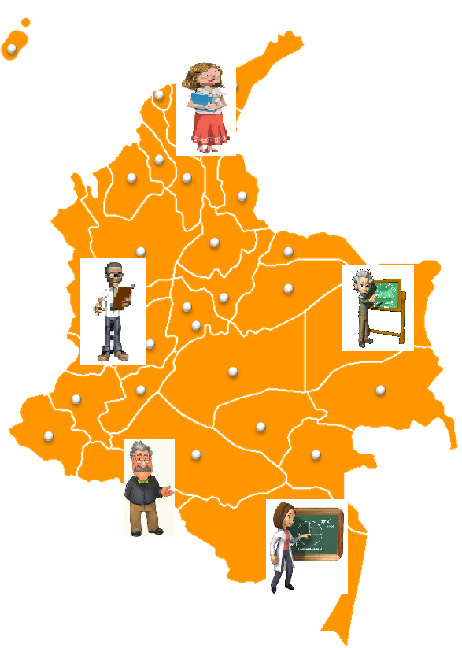
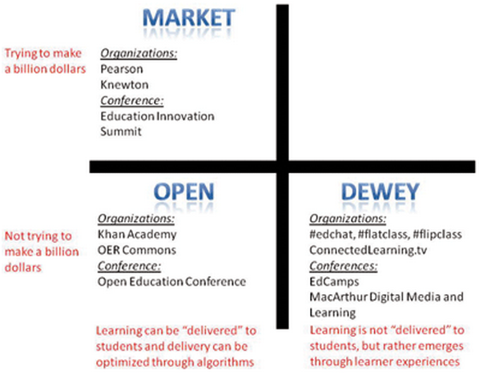
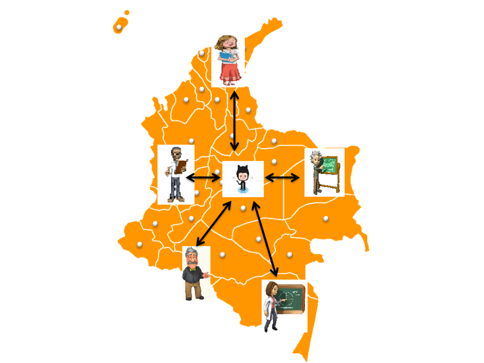
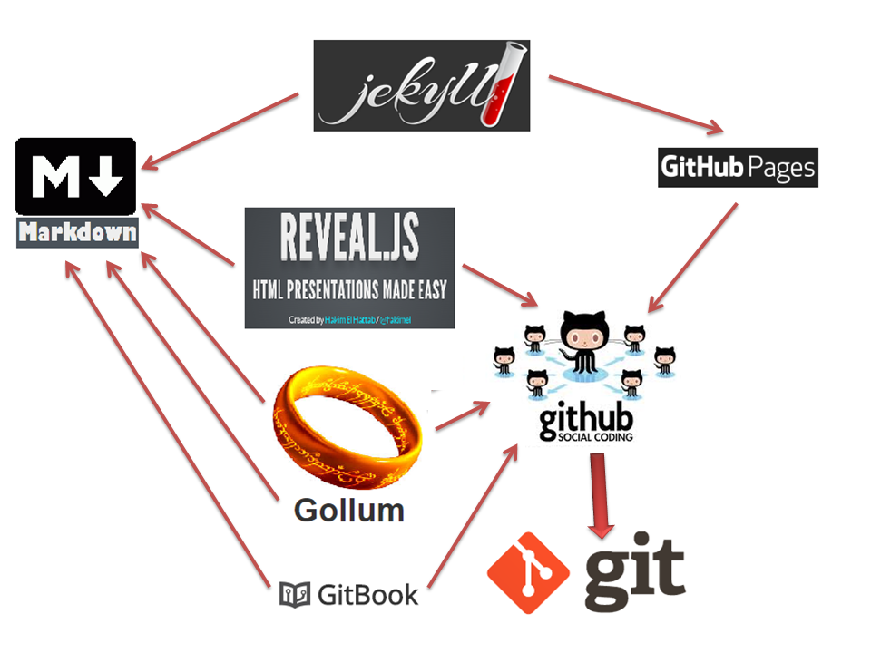
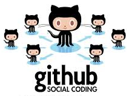
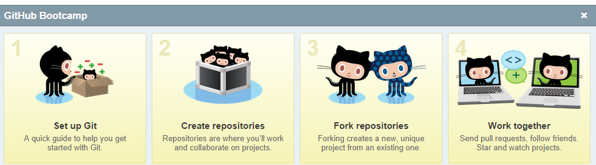
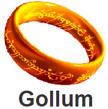
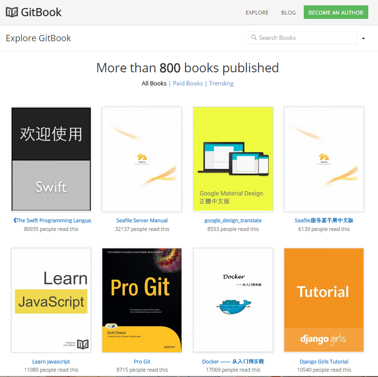
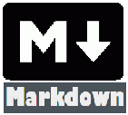

<!-- configuracion de colores es opcional pero ultil-->
<section id="themes">
	<h2>Configuración de temas</h2>
	

		Temas:  
		<a href="?#/themes">Default</a> -
		<a href="?theme=sky#/themes">Sky</a> -
		<a href="?theme=beige#/themes">Beige</a> -
		<a href="?theme=simple#/themes">Simple</a> -
		<a href="?theme=serif#/themes">Serif</a> -
		<a href="?theme=night#/themes">Night</a>  
		<a href="?theme=moon#/themes">Moon</a> -
		<a href="?theme=solarized#/themes">Solarized</a>
	

</section>

Slide:

#Gestión colaborativa del conocimiento

Slide:

#Agenda
* Necesidad detectada
* ¿Qué proyectos hay?
* MOOC
* Propuesta
* Un caso concreto

Slide:

##Necesidad detectada

* La mayoria de los profesores del país no colaboran entre sí para generar los contenidos educativos de los distintos niveles de la educación colombiana, de tal manera que ejercen su labor educativa de manera aislada y sin comunicación entre ellos.<!-- .element: class="fragment" data-fragment-index="1"-->  

Slide:

##Necesidad detectada

Slide:

##¿Qué proyectos hay?
* MOOC

Slide:
##MOOC
* MOOC (acrónimo en inglés de Massive Open Online Course y traducido al español como cursos en línea masivos y abiertos) es una modalidad de educación abierta, la cual se observa en cursos de pregrado ofrecidos gratuitamente a través de plataformas educativas en Internet; cuya filosofía es la liberación del conocimiento para que este llegue a un público más amplio.

Slide:
##MOOC
###Breve historia
* Los orígenes<!-- .element: class="fragment" data-fragment-index="1"-->
* El fenómeno MOOC está íntimamente ligado a otros dos fenómenos que han tenido lugar principalmente durante los últimos diez años:<!-- .element: class="fragment" data-fragment-index="2"-->
* a) El auge de los contenidos publicados en abierto y en especial los Recursos Educativos Abiertos (en inglés, Open Educational Resources). <!-- .element: class="fragment" data-fragment-index="3"-->
* b) El aprendizaje social abierto (Open Social Learning).<!-- .element: class="fragment" data-fragment-index="4"-->

Slide:
##MOOC
###Breve historia
####Los Recursos Educativos Abiertos
* 1999: El MIT lanzase su proyecto OpenCourseWare (la publicación de materiales docentes como contenidos abiertos)<!-- .element: class="fragment" data-fragment-index="1"-->
* Han sido varias las instituciones de educación superior que han creado sus propias versiones del mismo y puesto a disposición del público en general, a través de Internet, los contenidos de muchas de las asignaturas de sus programas de estudio.<!-- .element: class="fragment" data-fragment-index="2"-->

Slide:
##MOOC
###Breve historia
####Los Recursos Educativos Abiertos
* El entorno iberoamericano de las instituciones universitarias de educación superior ha desempeñado un papel muy importante en el proyecto OpenCourseWare.<!-- .element: class="fragment" data-fragment-index="1"-->
* Desde Universia, la red de universidades iberoamericanas, se motivó y estimuló que las universidades miembro de esta organización se adhirieran al proyecto liderado por el<!-- .element: class="fragment" data-fragment-index="2"-->[OpenCourseware Consortium](http://www.oeconsortium.org/).<!-- .element: class="fragment" data-fragment-index="3"-->
* Al 2013 unas 50 universidades de Iberoamérica formaban parte de la sección del consorcio organizada por Universia<!-- .element: class="fragment" data-fragment-index="4"--> 

Slide:
##MOOC
###Breve historia
####Los Recursos Educativos Abiertos

* Sin la existencia de esta enorme cantidad de contenidos abiertos disponibles de manera organizada, no sería posible el desarrollo de los MOOC, ya que el carácter masivo y abierto implica necesariamente el acceso también masivo y abierto a los contenidos y recursos educativos que se ofrezcan en el curso.<!-- .element: class="fragment" data-fragment-index="1"-->

Slide:
##MOOC
###Breve historia
####El Open Social Learning

* Las iniciativas que han triunfado son las que dan voz al usuario para que aporte, colabore, interactúe, etc., y que dichas aportaciones sean devueltas al resto de los usuarios en forma de conocimiento compartido.<!-- .element: class="fragment" data-fragment-index="1"-->
* Una de las motivaciones comunicativas que llevan a los usuarios a utilizar la Red es su necesidad de satisfacer sus propias y específicas necesidades de aprendizaje.<!-- .element: class="fragment" data-fragment-index="2"-->
* Aprender es una necesidad biológica y los usuarios de la Red han comenzado a utilizarla para cubrir esa necesidad de una manera informal.<!-- .element: class="fragment" data-fragment-index="3"-->

Slide:
##MOOC
###Breve historia
####El Open Social Learning
* El Open Social Learning ha evidenciado la existencia de una cantidad masiva de usuarios dispuestos a tomar lo que les ofrezcan y que cubra sus necesidades de aprendizaje, no importándoles la acreditación sino el acceso a la información de calidad y sistematizada.<!-- .element: class="fragment" data-fragment-index="1"--> 
* Las instituciones de educación superior no estaban preparadas para aprovechar este fenómeno hasta que no han dispuesto los contenidos abiertos y la tecnología apropiada para atender a esta masa de alumnos informales.<!-- .element: class="fragment" data-fragment-index="2"-->

Slide:
##MOOC
###Breve historia
####El nacimiento de los MOOC
* Los dos fenómenos mencionados anteriormente (Los Recursos Educativos Abiertos y El Open Social Learning) han preparado el terreno durante la década de 2000 para que a finales de la misma, surgiera el primer MOOC.<!-- .element: class="fragment" data-fragment-index="1"-->
* El primer curso en línea que recibió el apelativo de MOOC fue el curso “Connectivism and Connective Knowledge” organizado por George Siemens y Stephen Downes en la University of Manitoba (Canada) en agosto de 2008. En este curso de 12 semanas de duración se inscribieron aproximadamente unos 2.300 estudiantes de diferentes partes del mundo.<!-- .element: class="fragment" data-fragment-index="2"-->

Slide:
##MOOC
###Breve historia
####El nacimiento de los MOOC

* Posteriormente, George Siemens, Stephen Downes y Dave Cormier organizaron otros cursos MOOC similares (CCK09, CCK11, CCK12, Future of Education, PLENK, LAK11, LAK12, Change11, Critical Literacies), que en total acumularon más de 20.000 inscripciones entre todos ellos.<!-- .element: class="fragment" data-fragment-index="1"-->

Slide:
##MOOC
###Breve historia
####El nacimiento de los MOOC
* Sin embargo, el primer curso MOOC que realmente tuvo un éxito asombroso fue el curso “Introduction to Artificial Intelligence”, organizado en otoño de 2011 por Sebastian Thrun, profesor de Stanford University, y Peter Norvig, director de investigación de Google.<!-- .element: class="fragment" data-fragment-index="1"--> 
* En poco tiempo, unas 160.000 personas repartidas por todo el mundo se apuntaron a este curso sobre inteligencia artificial.<!-- .element: class="fragment" data-fragment-index="2"--> 
* Debido a este éxito, Sebastian Thrun abandonó su puesto como profesor en Stanford University y fundó la plataforma <!-- .element: class="fragment" data-fragment-index="3"--> [Udacity](https://www.udacity.com/).<!-- .element: class="fragment" data-fragment-index="4"-->

Slide:
##MOOC
###Breve historia
####El nacimiento de los MOOC

* El siguiente curso de gran éxito fue “Circuits & Electronics” en la primavera de 2012, organizado por el profesor Anant Agarwal del Massachusetts Institute of Technology (MIT) en su plataforma MITx, con más de 120.000 estudiantes inscritos de todo el mundo.<!-- .element: class="fragment" data-fragment-index="1"-->
* El éxito inesperado de estos dos cursos fue el detonante de la actual atención que reciben estos cursos. Poco después, los profesores Andrew Ng y Daphne Koller, también de Stanford University, fundaron la plataforma<!-- .element: class="fragment" data-fragment-index="2"--> [Coursera](https://www.coursera.org/) y comenzaron a ofrecer cursos a partir de abril de 2012.<!-- .element: class="fragment" data-fragment-index="3"-->

Slide:
##MOOC
###Breve historia
####El nacimiento de los MOOC
* Posteriormente, el 2 de mayo de 2012, el MIT y la Harvard University, en principio “grandes competidores” en el campo de batalla de las mejores universidades de Estados Unidos, anunciaron su proyecto conjunto <!-- .element: class="fragment" data-fragment-index="1"-->[edX](https://www.edx.org/), que tiene como objetivo desarrollar una plataforma MOOC común sin ánimo de lucro.<!-- .element: class="fragment" data-fragment-index="2"-->
* Los dos centros universitarios anunciaron que iban a invertir un total de 60 millones de dólares para desarrollar la plataforma y distribuir el material de las clases a través de vídeos, exámenes y pruebas teóricas en Internet.<!-- .element: class="fragment" data-fragment-index="3"-->

Slide:
##MOOC
###Breve historia
####El nacimiento de los MOOC
* Desde entonces, ambas instituciones junto con otras que se han unido posteriormente al proyecto, ofrecen cursos gratuitos a través de Internet en un proyecto colaborativo que busca romper los moldes de la educación universitaria tradicional.<!-- .element: class="fragment" data-fragment-index="1"-->

Slide:
##MOOC
###Sitios web que ofrecen cursos MOOC
* [Coursera](https://www.coursera.org/)
* [Udacity](https://www.udacity.com/)
* [edX](https://www.edx.org/)
* [Khan Academy](https://www.khanacademy.org/)
* [Udemy](https://www.udemy.com/)
* [Codecademy](http://www.codecademy.com/)
* [Lynda.com](http://www.lynda.com/)
* [SkilledUp](http://www.skilledup.com/)
* [Academic Earth](http://academicearth.org/)
* [Saylor.org](http://www.saylor.org/)
* [Canvas Network](https://www.canvas.net/)
* [MiríadaX](http://miriadax.net/)

Slide:
##MOOC
###Buscadores y comparadores de cursos MOOC
* [CourseTalk](http://www.coursetalk.com/)
* [Knollop](http://www.knollop.com/)
* [CourseBuffet](http://www.coursebuffet.com/)
* [Class Central](https://www.class-central.com/)

Slide:
##¿Qué es un MOOC?
* Un curso MOOC debe tener la consistencia y los objetivos necesarios para constituir un programa de aprendizaje de una materia o contenidos concretos. Es decir:<!-- .element: class="fragment" data-fragment-index="1"-->
* Debe tener unos objetivos de aprendizaje que deben alcanzar sus estudiantes después de realizar ciertas actividades en un plazo de tiempo dado (debe tener un comienzo y un final).<!-- .element: class="fragment" data-fragment-index="2"-->
* Además, debe de contar con evaluaciones que permitan medir y acreditar el conocimiento adquirido.<!-- .element: class="fragment" data-fragment-index="3"-->
* Y debe existir algún tipo de interacción entre los estudiantes y los profesores en todos los sentidos posibles (estudiante-estudiante y estudiante-profesor), aunque ésta esté mediada por la tecnología.<!-- .element: class="fragment" data-fragment-index="4"-->

Slide:
##¿Qué es un MOOC?
* Abierto: Abierto tiene varios significados en este tipo de cursos. Inicialmente, “abierto” tenía dos significados.<!-- .element: class="fragment" data-fragment-index="1"-->
* Primero, significaba que el curso debía estar abierto a todo el mundo (abierto a estudiantes de fuera de la universidad que organizaba el curso) y no debía exigir unos requisitos previos como la posesión de una titulación o la realización de unos estudios previos. Es decir, debía tener una “inscripción abierta”.<!-- .element: class="fragment" data-fragment-index="2"-->

Slide:
##¿Qué es un MOOC?
* La restricción de que, al menos, se debe estar registrado en el curso, lo diferencia de otros proyectos abiertos como es el Open CourseWare. En éste, el objetivo es la mera exposición de los contenidos sin necesitar hacer seguimiento de cómo el alumno consume el mismo, mientras que en los MOOC la intencionalidad educativa implica conocer cómo el alumno realiza el curso y los resultados que obtiene, obligando, por tanto, a llevar un registro personalizado del progreso.

Slide:
##¿Qué es un MOOC?
* “Abierto” proviene del concepto de Recursos Educativos Abiertso antes expuesto en los orígenes de los MOOC: inicialmente, “abierto” significaba que el curso hacía un uso intensivo de “contenidos abiertos” (open content) y los contenidos propios que generaba el curso también se debían publicar en abierto (open license) para que pudieran ser reutilizados por otras personas.<!-- .element: class="fragment" data-fragment-index="1"-->
* Esta interpretación de “abierto” es la que menos se cumple en la actualidad, ya que los cursos MOOC de más éxito están alojados en plataformas creadas por empresas, como Coursera o Udacity, que no tienen mucho interés en compartir sus cursos de forma abierta.<!-- .element: class="fragment" data-fragment-index="2"--> 

Slide:
##¿Qué es un MOOC?
* Además, el concepto de “abierto” en este sentido no sólo debe ser una declaración de intenciones, sino que el material producido y ofertado bajo esta fórmula debe estar técnicamente accesible y disponible, en formatos reutilizables y, si es posible, adaptables.

Slide:
##¿Qué es un MOOC?

* Los primeros MOOC no precisaban de una plataforma tecnológica ad hoc para su desarrollo. OpenEd07 discurría sobre un entorno basado en Wikimedia, la misma plataforma que hace funcionar la Wikipedia; “Connectivism and Connective Knowledge (2008)” de George Siemens basaba su funcionamiento en Wikispaces y en varios agregadores de blogs.

Slide:
##¿Qué es un MOOC?

*  Pero durante el año 2012 y 2013 surgieron varias plataformas tecnológicas de carácter abierto especialmente diseñadas para la creación de MOOC. De entre todas ellas se destacan:

* [edX](http://code.edx.org/)
* [Google Coursebuilder](https://code.google.com/p/course-builder/)
* [OpenClass](http://www.pearsonhighered.com/openclass/)
* [OpenMOOC](http://mooc.org/)

Slide:
##¿Qué es un MOOC?
* Debe ser en línea: El curso se realiza a distancia a través de Internet y no requiere la asistencia física a un aula. Esta característica es esencial para que cualquier persona desde cualquier parte del mundo con una conexión a Internet pueda participar en estos cursos y así lograr que se cumpla la siguiente característica.<!-- .element: class="fragment" data-fragment-index="1"-->
* Gran escala: Un curso MOOC debe permitir el acceso a un número muy grande de estudiantes, mucho mayor que una clase presencial o un curso en línea tradicional. Además, el curso debe estar preparado para aceptar cambios en el número de estudiantes en varios órdenes de magnitud, por ejemplo, pasar de 1.000 a 100.000 estudiantes, sin que eso suponga un problema importante para su funcionamiento.<!-- .element: class="fragment" data-fragment-index="2"-->

Slide:
##Tipos de MOOC
* Existen varias formas de clasificar los cursos MOOC. La más conocida distingue dos tipos de MOOC: los MOOC conectivistas (cMOOC) y los MOOC comerciales (xMOOC)<!-- .element: class="fragment" data-fragment-index="1"-->
* Los cMOOC son los primeros MOOC que surgieron (“Introduction to Open Education”, “Connectivism and Connective Knowledge”). Estos MOOC ponen su énfasis en la creación de conocimiento por parte de los estudiantes, en la creatividad, la autonomía, y el aprendizaje social y colaborativo.<!-- .element: class="fragment" data-fragment-index="2"-->
* Los xMOOC, son los cursos que se han hecho más populares, los que se ofrecen a través de plataformas comerciales o semicomerciales como Coursera, edX y Udacity. Estos MOOC ponen su énfasis en un aprendizaje tradicional centrado en la visualización de vídeos y la realización de pequeños ejercicios de tipo test.<!-- .element: class="fragment" data-fragment-index="3"-->

Slide:
##Tipos de MOOC
* Otra clasificación similar a la anterior14 establece una matriz 2×2 en base a las respuestas a dos preguntas que deben contestar los organizadores de un curso MOOC:<!-- .element: class="fragment" data-fragment-index="1"-->
* 1. ¿Intentas ganar miles de millones de dólares?<!-- .element: class="fragment" data-fragment-index="2"-->
* 2. ¿Crees que el aprendizaje ocurre principalmente a través de la transferencia del conocimiento?<!-- .element: class="fragment" data-fragment-index="3"-->

Slide:
##Tipos de MOOC

Slide:
##Críticas a los MOOC
* Ejemplo: En julio de 2013 San Jose State University pauso su experimento con Udacity debido a:<!-- .element: class="fragment" data-fragment-index="1"-->
* A los estudiantes de de los cursos de Udacity en línea no les fue tan bien como a los estudiantes que asistieron a las clases normales.Al parecer, por la falta de interacción cara a cara con el docente.<!-- .element: class="fragment" data-fragment-index="2"-->
* Cuando se comenzaron a ofertar los cursos, estos aún no se habían terminado de diseñar, pero se pusieron en marcha debido a los acuerdos comerciales con Udacity.<!-- .element: class="fragment" data-fragment-index="3"-->
*  Los estudiantes no tenían un compromiso real con los cursos ofertados en línea, debido a la flexibilidad propia de esta dinámica que busca reemplazar la asistencia al aula por la lección en internet.<!-- .element: class="fragment" data-fragment-index="4"-->

Slide:
##Críticas a los MOOC
* En un seguimiento que se hizo a los estudiantes de 23 cursos de Stanford alojados en Coursera se encontró:<!-- .element: class="fragment" data-fragment-index="1"-->
* En total, menos del 10% de los estudiantes participaron en los foros.<!-- .element: class="fragment" data-fragment-index="2"-->
* Hay muchos estudiantes que se matriculan en los MOOC por curiosidad, sin intención de completar las actividades del curso.<!-- .element: class="fragment" data-fragment-index="3"-->
* Se presenta el fenómeno del embudo: al principipo se inscriben muchos estudiantes, pero al final terminan pocos.<!-- .element: class="fragment" data-fragment-index="4"-->

Slide:
##Críticas a los MOOC
* Algunos profesores y departamentos de distintas universidades han manifestado públicamente opiniones en contra de los MOOC y su uso como sustituto de las clases presenciales.<!-- .element: class="fragment" data-fragment-index="1"-->
* Hay incluso algún caso de alguna universidad que ha rechazado colaborar con alguna de las plataformas MOOC. Una de las razones es el temor a que el mismo curso sea realizado por miles de alumnos de diferentes universidades y se convierta en una especie de “pensamiento único”.<!-- .element: class="fragment" data-fragment-index="2"-->

Slide:
##Críticas a los MOOC
* Además, el movimiento MOOC puede derivar en dos tipos de universidades: las primeras, muy bien financiadas en las que estudiantes privilegiados son enseñados por profesores “cara a cara”; las segundas, con poca financiación, en las que los alumnos visualizan vídeos de clases previamente grabadas y en las que la participación del profesor se reduce a la función de un mero asistente.

Slide:

#Propuesta

Slide:
##Propuesta
* Integrar las herramientas asociadas a Git y GutHub en una metodología (y posible herramienta a desarrollar) que permita a los docentes del país crear y gestionar conocimiento de manera colaborativa, de tal manera que se puedan crear cursos y contenidos acordes a las necesidades propias de los estudiantes pertenecientes a un determinado contexto social, económico y cultural del departamento en el que vivan. 

Slide:

Slide:
##Herramientas involucradas

Slide:

* Git is a free and open source distributed version control system designed to handle everything from small to very large projects with speed and efficiency. <!-- .element: class="fragment" data-fragment-index="1"-->
* Git is easy to learn and has a tiny footprint with lightning fast performance. It outclasses SCM tools like Subversion, CVS, Perforce, and ClearCase with features like cheap local branching, convenient staging areas, and multiple workflows. <!-- .element: class="fragment" data-fragment-index="2"-->
* Sitio:<!-- .element: class="fragment" data-fragment-index="3"-->[http://git-scm.com/](http://git-scm.com/)<!-- .element: class="fragment" data-fragment-index="4"-->

Slide:

* GitHub is a Git repository web-based hosting service, which offers all of the distributed revision control and source code management (SCM) functionality of Git as well as adding its own features. <!-- .element: class="fragment" data-fragment-index="1"-->
* Unlike Git, which is strictly a command-line tool, GitHub provides a web-based graphical interface and desktop as well as mobile integration. <!-- .element: class="fragment" data-fragment-index="2"-->
* It also provides access control and several collaboration features such as wikis, task management, and bug tracking and feature requests for every project.<!-- .element: class="fragment" data-fragment-index="3"-->

Slide:

* GitHub is the best place to share code with friends, co-workers, classmates, and complete strangers. Over six million people use GitHub to build amazing things together.<!-- .element: class="fragment" data-fragment-index="1"-->

<!-- .element: class="fragment" data-fragment-index="2"-->

* Sitio:<!-- .element: class="fragment" data-fragment-index="3"--> [https://github.com/](https://github.com/)<!-- .element: class="fragment" data-fragment-index="4"-->

Slide:

* Gollum is a simple wiki system built on top of Git.<!-- .element: class="fragment" data-fragment-index="1"-->
* Gollum wikis are simply Git repositories that adhere to a specific format. Gollum pages may be written in a variety of formats and can be edited in a number of ways depending on your needs. You can edit your wiki locally:<!-- .element: class="fragment" data-fragment-index="2"-->
* With your favorite text editor or IDE (changes will be visible after committing).<!-- .element: class="fragment" data-fragment-index="3"-->
* With the built-in web interface.<!-- .element: class="fragment" data-fragment-index="4"-->
* With the Gollum Ruby API.<!-- .element: class="fragment" data-fragment-index="5"-->
* Repositorio en GitHub:<!-- .element: class="fragment" data-fragment-index="6"--> [https://github.com/gollum/gollum](https://github.com/gollum/gollum)<!-- .element: class="fragment" data-fragment-index="7"-->

Slide:

* A framework for easily creating beautiful presentations using HTML.<!-- .element: class="fragment" data-fragment-index="1"-->
* reveal.js comes with a broad range of features including nested slides, markdown contents, PDF export, speaker notes and a JavaScript API. It's best viewed in a browser with support for CSS 3D transforms but fallbacks are available to make sure your presentation can still be viewed elsewhere.<!-- .element: class="fragment" data-fragment-index="2"-->
* <!-- .element: class="fragment" data-fragment-index="3"-->[Demo](http://lab.hakim.se/reveal-js/#/)<!-- .element: class="fragment" data-fragment-index="4"-->
* Repositorio en GitHub:<!-- .element: class="fragment" data-fragment-index="5"-->[https://github.com/hakimel/reveal.js#markdown](https://github.com/hakimel/reveal.js#markdown)<!-- .element: class="fragment" data-fragment-index="6"-->

Slide:

* GitHub Pages are public webpages freely hosted and easily published through our site. You can create and publish them online using the Automatic Page Generator.<!-- .element: class="fragment" data-fragment-index="1"--> 
* If you prefer to work locally, you can use the GitHub for Mac and Windows apps, or the command line.<!-- .element: class="fragment" data-fragment-index="2"-->
* Sitio:<!-- .element: class="fragment" data-fragment-index="3"-->https://pages.github.com/<!-- .element: class="fragment" data-fragment-index="4"-->
 

Slide:

Slide:

Slide:

<

* Sitio:<!-- .element: class="fragment" data-fragment-index="2"-->https://www.gitbook.io/<!-- .element: class="fragment" data-fragment-index="3"-->

Slide:

Slide:

* Jekyll is a simple, blog-aware, static site generator.<!-- .element: class="fragment" data-fragment-index="1"-->
* It takes a template directory containing raw text files in various formats, runs it through Markdown (or Textile) and Liquid converters, and spits out a complete, ready-to-publish static website suitable for serving with your favorite web server.<!-- .element: class="fragment" data-fragment-index="2"-->
* Jekyll also happens to be the engine behind GitHub Pages, which means you can use Jekyll to host your project’s page, blog, or website from GitHub’s servers for free.<!-- .element: class="fragment" data-fragment-index="3"-->
* Sitio:<!-- .element: class="fragment" data-fragment-index="4"-->
 http://jekyllrb.com/<!-- .element: class="fragment" data-fragment-index="5"-->

Slide:

* Markdown is a text-to-HTML conversion tool for web writers. Markdown allows you to write using an easy-to-read, easy-to-write plain text format, then convert it to structurally valid XHTML (or HTML).<!-- .element: class="fragment" data-fragment-index="1"-->
* Thus, “Markdown” is two things:<!-- .element: class="fragment" data-fragment-index="2"-->
* (1) a plain text formatting syntax<!-- .element: class="fragment" data-fragment-index="3"-->
* (2) a software tool, written in Perl, that converts the plain text formatting to HTML.<!-- .element: class="fragment" data-fragment-index="4"-->

Slide:

* The overriding design goal for Markdown’s formatting syntax is to make it as readable as possible.<!-- .element: class="fragment" data-fragment-index="1"-->
* The idea is that a Markdown-formatted document should be publishable as-is, as plain text, without looking like it’s been marked up with tags or formatting instructions.<!-- .element: class="fragment" data-fragment-index="2"-->
* While Markdown’s syntax has been influenced by several existing text-to-HTML filters, the single biggest source of inspiration for Markdown’s syntax is the format of plain text email.<!-- .element: class="fragment" data-fragment-index="3"-->
* The best way to get a feel for Markdown’s formatting syntax is simply to look at a Markdown-formatted document.<!-- .element: class="fragment" data-fragment-index="4"-->
* Markdown is free software, available under a BSD-style open source license. <!-- .element: class="fragment" data-fragment-index="5"-->
* Sitio:<!-- .element: class="fragment" data-fragment-index="6"-->http://daringfireball.net/projects/markdown/<!-- .element: class="fragment" data-fragment-index="7"-->

Slide:
#Un caso concreto

Slide:
# [El curso del profesor Kris Shaffer](http://kris.shaffermusic.com/musicianshipResources/)

Slide:
##References
* http://en.wikipedia.org/wiki/GitHub
* https://github.com/about
* https://help.github.com/articles/what-are-github-pages/
* http://git-scm.com/
* https://github.com
* https://github.com/gollum/gollum
* https://github.com/hakimel/reveal.js#markdown
* https://pages.github.com/
* https://www.gitbook.io/
* http://jekyllrb.com/
* http://daringfireball.net/projects/markdown/
* http://www.centrocp.com/los-mooc-origenes-historia-y-tipos/
* http://elbonia.cent.uji.es/jordi/2013/07/21/mooc-el-abismo-de-la-desilusion/

Slide:
##References
* https://www.insidehighered.com/news/2013/07/18/citing-disappointing-student-outcomes-san-jose-state-pauses-work-udacity
* https://www.insidehighered.com/news/2013/07/09/higher-ed-leaders-urge-slow-down-mooc-train
* http://aj.spadial.com/push-pull-fork-github-para-academicos.html
* http://kris.shaffermusic.com/musicianshipResources/
